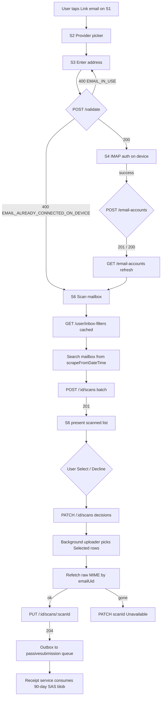
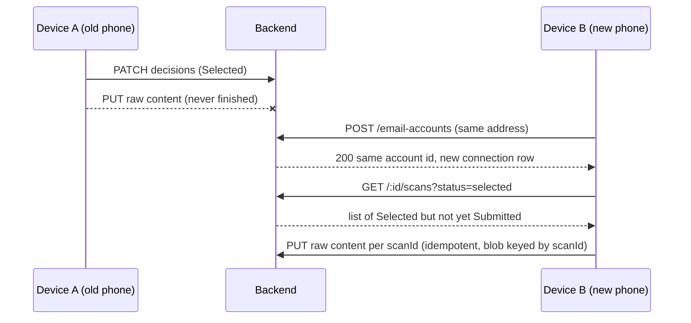

# Passive Collection — Imagined Flow, Screens & Design-Doc Issues

**Source ticket:** [Azure Boards #214774 — Passive collection Doc](https://dev.azure.com/worldpanelbynumerator/KT-DataCollection/_workitems/edit/214774)
**Source document:** `Passive-Collection.pdf` (19 pages, dated 2026-09-23), attached to the ticket.
**Purpose of this doc:** Reconstruct the end-to-end product flow (no UI mockups are attached, so screens are inferred from the spec), and flag major problems / ambiguities / risks that QA and Dev should resolve before the story is groomed for delivery.

---

## 1. High-level product story (imagined)

Passive Collection lets a Shoppix user link one or more personal mailboxes (Gmail / Yahoo / Outlook). The app scans those mailboxes on-device for receipt / order emails matching a global set of sender+subject rules, shows the user what it found, and — with the user's consent — uploads the raw MIME of selected emails so the receipt pipeline can process them.

Key promises to the user:
- **Credentials never leave the device.** Backend only tracks *which* address is linked and *what* was scanned.
- **One user, one email.** An address can be actively linked to only one Shoppix account.
- **Multi-device is transparent.** Add the same mailbox to a second phone → no duplicate scans, no duplicate uploads, no re-nagging for consent that was already given.
- **Voluntary vs. broken disconnect are different.** Voluntary disconnect stays silent; revoked app-password shows a "reconnect" prompt.

---

## 2. Imagined app screens

The PDF describes only the backend API. The screens below are the minimum the client contract in section 11 implies.

| # | Screen | Trigger / entry | Key elements |
|---|---|---|---|
| S1 | **Passive Collection home** (list of linked mailboxes) | Menu → "Email receipts" | Per-account row: provider icon, address, `connectionStatus` chip, "Last scanned <date>", overflow menu (Disconnect this device / Disconnect everywhere). Empty state → "Link an email". |
| S2 | **Provider picker** | Tap "Link an email" | Gmail / Yahoo / Outlook tiles. |
| S3 | **Email address entry** | After S2 | Address input, "Continue". Blocking states shown inline: `EMAIL_IN_USE`, `INVALID_EMAIL_ADDRESS`, `EMAIL_ALREADY_CONNECTED_ON_DEVICE` (→ skip straight to S6). |
| S4 | **On-device IMAP auth** | After S3 (200 from `/validate`) | Provider-specific auth (app password entry or OAuth webview). Success → creds saved in device secure storage. |
| S5 | **"Also connect on this device?"** prompt | S1 shows an entry under `otherDevices` | "You've linked user@gmail.com on another phone. Add it here too?" → Confirm → skip S3 and reuse the provider from `otherDevices[i].emailProvider`. |
| S6 | **Scanned emails list** | Auto-opens after scan completes | Per email row: subject, sender, received date, Select checkbox, Decline action. Pagination footer ("128 emails · page 1/3"). Hidden `scanId` field on each row. |
| S7 | **Background sync banner / progress** | Any screen while uploader is active | "Uploading 3 of 12 receipts…" chip, non-blocking. |
| S8 | **Reconnect prompt** | `connectionStatus = ConnectionFailed` on any account | Persistent banner on S1 + push notification → tap → S4. NOT shown for `Disconnected`. |
| S9 | **Disconnect confirmation dialog** | Overflow → Disconnect | Two options: "Disconnect this phone only" (scope=device) vs "Disconnect everywhere & delete data" (scope=all). Warning text explains what "everywhere" removes. |
| S10 | **Account deletion — server-driven** | Handled by profile-deletion / dropout topic | App silently receives `404 EMAIL_ACCOUNT_NOT_FOUND` on next call → purge local cache, remove account row from S1. |

---

## 3. End-to-end flow

Multi-device resume:

---

## 4. Major problems / risks found in the design doc

Ranked by severity. QA should raise each of these before signing off the story.

### 4.1 CRITICAL — `DELETE /user/email-accounts/{id}?scope=all` will wipe blobs of *other* mailboxes the same user has linked
Section 5 explicitly says: **"One blob container per customer, named after the `AppUserId`"** — i.e. the container is per **user**, not per **account**.
Section 4.8 for `scope=all` says: **"hard-delete the user's blob container"**.
So if a user has linked both `me@gmail.com` and `me@outlook.com`, deleting the Gmail account will destroy the raw content still in-flight for the Outlook account, and vice-versa. Section 7's per-user cleanup is correct (it fires on account termination); Section 4.8's per-account cleanup is not. **Fix:** delete only the blobs owned by that `AppUserEmailAccount` (blobs are keyed by `scanId`, and scan-log rows are already scoped by account).

### 4.2 CRITICAL — Contradictory HTTP status for `EMAIL_ALREADY_CONNECTED_ON_DEVICE` in section 4.3
- Section 4.3 processing step 4 says: *"Existing row with status Connected → **409** EMAIL_ALREADY_CONNECTED_ON_DEVICE"*.
- Section 4.3 response table for the same code says: **`400`**.
- Section 4.2 also uses `400`.
- Section 8 error-code table uses `400`.
Clients cannot ship against this contract until the doc picks one status. **Recommendation:** keep `400` everywhere (matches section 8).

### 4.3 HIGH — `EmailUid` semantics are inconsistent between DB schema and app contract
- Section 3.3 defines `EmailUid` as *"IMAP/provider unique identifier for the message"* and constrains it to `VARCHAR(200)`.
- Section 11.1 says the app **must** use a *"stable provider identifier (e.g. Gmail message-id), because IMAP UIDs can change if UIDVALIDITY changes"* — i.e. explicitly not the IMAP UID.
Because dedup is `UNIQUE(AppUserEmailAccountId, EmailUid)`, mixing IMAP UIDs and RFC-822 `Message-ID`s across devices / providers will silently produce duplicates or false collisions. Also, RFC 5322 `Message-ID` can be up to 998 chars; `VARCHAR(200)` risks truncation for Yahoo / mailing-list style IDs. **Fix:** rename the column to `ProviderMessageId`, mandate the provider-stable identifier in the API contract, and widen to at least `VARCHAR(998)`.

### 4.4 HIGH — Concurrent decisions on the same `scanId` from two devices are not defined
Section 4.6 says the batch is applied in a single transaction but does not describe what happens if Device A PATCHes `scanId=X → Selected` at the same time Device B PATCHes `X → Declined`. Both start from `Scanned`, so both would succeed under naïve last-write-wins, and the loser's outcome (e.g. user submitted content after Declined won) is silently overridden. **Fix:** add an optimistic-concurrency token (row version / `UpdatedDateTime`) or specify last-write-wins as an intentional business rule.

### 4.5 HIGH — No maximum size on `POST /:id/scans` batch, `PATCH /:id/scans` batch, or `PUT /:id/scans/:scanId` body
- `POST /scans` can carry an unbounded array of metadata → a malicious or buggy client can DoS the DB with a single request.
- `PUT /scans/{scanId}` accepts `emailRawData` (raw MIME) with no size cap; provider mailboxes routinely allow 25 MB per email, and large receipts with PDF attachments push into the tens of MB. Blob storage tolerates it, but the API gateway / request-body limits do not.
**Fix:** publish explicit limits (e.g. 500 scans per batch, 25 MB per PUT) and document the 4xx code returned when exceeded.

### 4.6 MEDIUM — No API returns the list of a user's devices / connections
Section 4.1 splits accounts by `currentDevice` vs `otherDevices` but never exposes *which* other devices. A user cannot see "linked on Phone A, Tablet B" to make an informed choice before `scope=all`. Retailer-Linking has the same shape today, but this story is a good opportunity to add it. **Fix:** either add `otherDevices[i].connections[]` or a dedicated `GET /user/email-accounts/{id}/connections`.

### 4.7 MEDIUM — Orphaned `AppUserEmailConnection` rows when a Device is removed from the Profile DB
Section 2 explicitly says `AppUserEmailAccount.AppUserId` is *"an indexed column, not a foreign key"* and `AppUserEmailConnection.DeviceId` is only "matches Profile DB `Device.Id`". So when a device is factory-reset / removed in Profile, the connection rows here stay `Connected` forever, incorrectly show up under `otherDevices` for that user, and let stale devices pass `4.4` / `4.6` / `4.7` if their JWT / DeviceId is somehow replayed. **Fix:** subscribe to whatever `deviceDeleted` event Profile already publishes and cascade to `Deleted`.

### 4.8 MEDIUM — Blob-write and DB-transaction ordering can produce `Submitted=true` with no blob
Section 4.7 lists steps as *4. upload blob → 5. DB update → 6. outbox*, wrapped in a *"single DB transaction for steps 5–6"*. If the blob upload succeeds but the DB commit fails and the retry is served by a different app instance whose local state was mid-flight, no problem — the retry rewrites the blob (same key) and commits. But there is no compensating action for the reverse ordering that some implementations accidentally introduce (commit first, then upload). **Fix:** state explicitly that the blob is uploaded **before** the transaction commits and that the outbox row is written **inside** the transaction (currently implied but easy to miss).

### 4.9 MEDIUM — 90-day SAS expiry has no re-issue path
Section 5 acknowledges that a dead-lettered message replayed after 90 days *"is an accepted edge case requiring manual reprocessing"*. In practice this means every outage that lasts longer than the storage retention needs an ops runbook, and there is nowhere for the receipt service to ask "give me a fresh SAS for `scanId=X`". **Fix:** add an internal `GET /internal/email-accounts/{id}/scans/{scanId}/sas` (service-to-service auth) so re-processing can be automated.

### 4.10 MEDIUM — `POST /validate` (4.2) does not validate `emailProvider`
The validate endpoint accepts only `emailAddress`; `emailProvider` is only checked inside `POST /email-accounts` (4.3). This means a user can pass validation, complete the on-device IMAP flow (potentially wasteful on OAuth for the wrong provider) and only *then* be blocked by `INVALID_EMAIL_PROVIDER`. **Fix:** move provider validation to `/validate` too, or accept it as an optional field there.

### 4.11 LOW — Anonymised `EmailAddress` set to the row `Id`, but the column type is `VARCHAR(320)` and the format is not documented
Overwriting a real email address with `8b3c0000-0000-0000-0000-000000000000` breaks any downstream tooling that expects an email shape (BI, exports, support tools). **Fix:** prefix it (e.g. `anonymised:{id}@deleted.local`) so it is still schema-valid and unmistakably anonymised.

### 4.12 LOW — `GET /:id/scans` has no ordering guarantee
Pagination is defined but no `orderBy` is documented. Multi-device resume (11.7) relies on stable ordering to avoid re-reading the same page. **Fix:** state that results are ordered by `CreatedDateTime ASC, Id ASC` (or similar).

### 4.13 LOW — Terminal `Declined` cannot be recovered even if the user changed their mind
Section 4.6 makes `Declined` permanent per business intent, but there is no operator override, and no telemetry to detect users who repeatedly bump into `EMAIL_ALREADY_DECLINED`. Acceptable if intentional; call it out in the PBI so support knows.

### 4.14 LOW — Doc does not say what happens if `POST /:id/scans` is called with `lastScrapedDateTime` missing / null
`lastScrapedDateTime` is described as "client-supplied, forward-only" but no validation code is defined for missing values. Presumably `400`, but which code?

### 4.15 LOW — No rate limiting mentioned
An abusive or looping client can call `POST /scans` or `PATCH /scans` at arbitrary rates. Retailer-Linking presumably has a policy; passive collection should inherit it and say so.

### 4.16 INFO — Screenshots / UI mock-ups are missing from the ticket
`Passive-Collection.pdf` is a backend spec only. The client contract in section 11 is enough to build against, but there are no Figma links, empty-state copy, error-copy, or accessibility notes. Test cases below cover functional API behaviour + inferred UX; visual regression cannot be planned until designs are attached.

---

## 5. Data sources summary

| Source | Content | Used for |
|---|---|---|
| Work item title & type | *"Passive collection Doc"*, `Product Backlog Item`, State: `New`, no description / AC / comments / tags / assignee / related items / PRs. | Framing the story; no functional detail. |
| Attachment: `Passive-Collection.pdf` (19 pages) | Full backend design: overview, domain model, DB schema, 9 API endpoints, error codes, outbox / blob storage, multi-device rules, account-deletion cleanup, client (app) contract, edge-case table. | Basis for **every** test case, every issue above, and the flow / screens in sections 2–3. |
| Inline images inside the PDF | None (no screenshots, no diagrams — the PDF is text + tables only). | N/A. |
| Related past tickets | Search for "retailer linking email passive collection IMAP inbox" returned no matches in the knowledge base. | N/A. |

---

## 6. Test-case strategy

- **Functional coverage** for each of the 9 endpoints (`GET /email-accounts`, `POST /validate`, `POST /email-accounts`, `POST /:id/scans`, `GET /:id/scans`, `PATCH /:id/scans`, `PUT /:id/scans/:scanId`, `DELETE /:id`, `POST /:id/connection-failure`).
- **Negative coverage** for every error code in section 8.
- **Edge cases** from section 11.11 plus the race / anonymisation flows.
- **Integration** with reused infra (`inbox-filters`, outbox, `useraccountstatusupdated`).
- **Regression** placeholders for retailer-linking touch-points.
- **UX / accessibility** for the inferred screens (marked as Visual / Accessibility so QA knows they are design-dependent).
- **Security** for JWT policy, SAS scope, cross-user id fuzzing.

The Excel export next to this document contains the full TestRail-compatible list.
